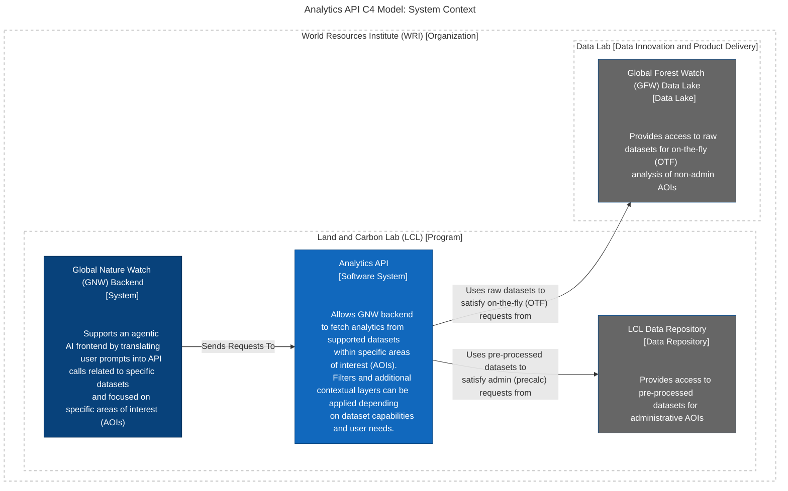

# Architectural Overview

## C4 System Context Diagram for Global Nature Watch (GNW) Analytics API

### Intent

A System Context diagram helps you to answer the following questions.
1. What is the software system that we are building (or have built)?
1. Who is using it?
1. How does it fit in with the existing environment?

### Motivation

- It makes the context and scope of the software system explicit so that there are no assumptions.
- It shows what is being added (from a high-level) to an existing environment.
- It’s a high-level diagram that technical and non-technical people can use as a starting
  point for discussions.
- It provides a starting point for identifying who you potentially need to go and talk to
  as far as understanding inter-system interfaces is concerned.

### Audience

Technical and non-technical people, inside and outside of the immediate software development team.

## Notes
Right-click linked nodes in the diagram when viewing in Github due to security issues.