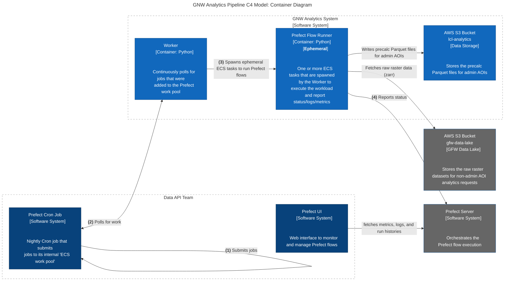

# Architectural Overview

## C4 Container Diagram for Global Nature Watch (GNW) Analytics Pipeline

### Intent

The Container diagram shows the high-level shape of the software architecture and how
responsibilities are distributed across it. It also shows the major technology choices,
how they are used, and how containers communicate with each other. It’s a high-level
**technology focussed** diagram that is useful for software developers and
support/operations staff alike.

A container diagram helps you answer the following questions:
1. What is the overall shape of the software system?
1. What are the high-level technology decisions?
1. How are responsibilities distributed across the system?
1. How do containers communicate with one another?
1. As a developer, where do I need to write code in order to implement features?

### Motivation

Where a System Context diagram shows your software system as a single box,
a Container diagram opens this box up to show what’s inside it.

This is useful because:
- It makes the high-level technology choices explicit.
- It shows the relationships between containers, and how those containers communicate.

### Audience

Technical people inside and outside of the immediate software development
team; including everybody from software developers through to operational
and support staff.

## Notes
Right-click linked nodes in the diagram when viewing in Github due to security issues.