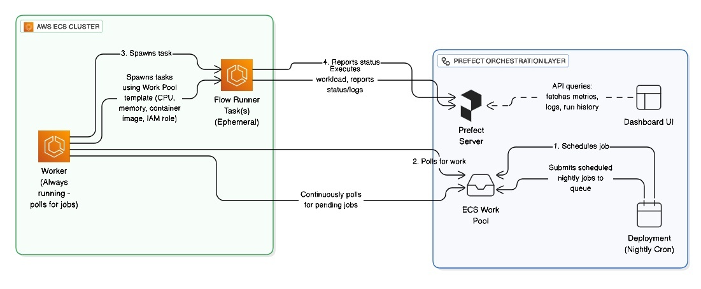
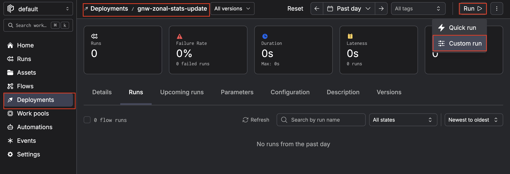
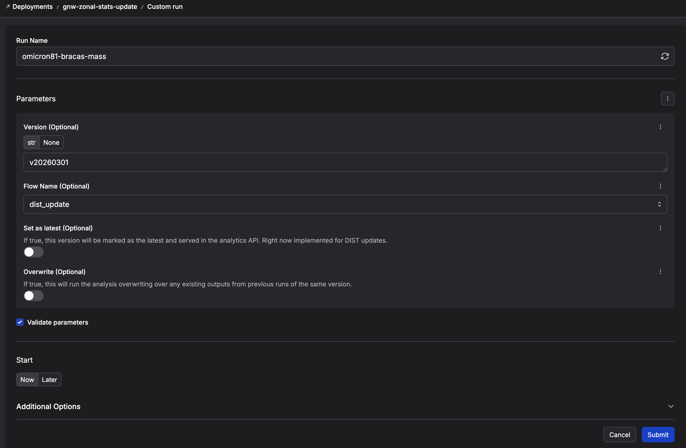
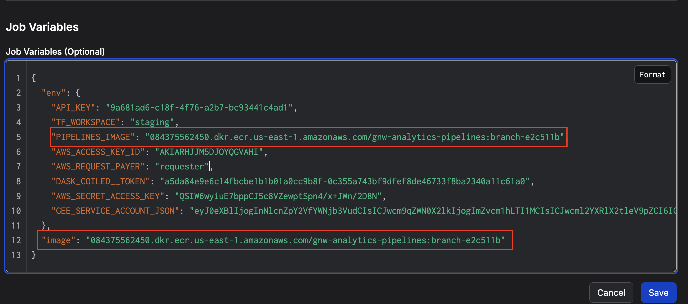

# Pipelines

## Running Tests

```bash
cd pipelines
uv sync            # if not already done
source .venv/bin/activate  # if not already activated
AWS_PROFILE=<GFW Data API production profile> pytest test
```

## Running Pipeline Code Locally

### AWS Permissions

Pipelines interact with S3 resources in the Zeno AWS account. Make sure you have a valid AWS profile configured with the necessary permissions before running any pipeline:

```bash
export AWS_PROFILE=<zeno-profile>
```

### Coiled (Dask Cluster)

Pipeline zonal stats computations run on a Dask cluster managed by [Coiled](https://cloud.coiled.io/). If not already logged in, authenticate from the terminal:

```bash
coiled login
```

Coiled syncs your local Python environment to the remote Dask scheduler and workers. Before running a pipeline, make sure:

1. **Activate the pipelines virtual environment** — the Coiled cluster is provisioned using packages from your active environment.
2. **Keep the environment up to date** — run `uv sync` so the packages Coiled syncs to the cluster match what the pipeline code expects.

```bash
cd pipelines
uv sync
source .venv/bin/activate
```

> **⚠ Architecture note:** The Coiled cluster in `run_updates.py` uses ARM-based instances (`r7g` family). If your local machine is not ARM (e.g. Intel/AMD x86_64), you may encounter package incompatibilities when Coiled attempts to sync your environment. Running from an Apple Silicon Mac or another ARM host avoids this issue.

### Prefect

To monitor pipeline flows via the Prefect UI, there are two options depending on what's configured in `~/.prefect/profiles.toml`:

#### Option 1: Local Prefect Server

Spin up a local Prefect server in a separate terminal session:

```bash
prefect server start
```

The Prefect dashboard will be available at http://127.0.0.1:4200 and local pipeline runs will show up there.

#### Option 2: Prefect Cloud

If the active profile in `~/.prefect/profiles.toml` points to a Prefect Cloud workspace, runs will appear in the cloud dashboard instead. Example `profiles.toml`:

```toml
active = "local"

[profiles.local]
PREFECT_API_URL = "https://api.prefect.cloud/api/accounts/<account-id>/workspaces/<workspace-id>"
PREFECT_API_KEY = "*********"
```

### Running a Pipeline

Pipelines are launched via the Click CLI in `run_updates.py`. Run with `--help` to see all available options:

```bash
python -m pipelines.run_updates --help
```

```
Usage: python -m pipelines.run_updates [OPTIONS]

Options:
  --flow [dist_update|tcl_update]
                                  Which update flow to run.
  --version TEXT                  Dataset version (required for tcl_update).
  --overwrite                     Overwrite existing outputs.
  --is-latest                     Mark this version as latest.
  --help                          Show this message and exit.
```

Example — run the DIST alerts update:

```bash
python -m pipelines.run_updates --flow dist_update --version v20260301
```

## Running Pipeline from Prefect Cloud UI

### Architecture Overview



Pipelines are deployed to **Prefect Cloud** and execute on **AWS ECS Fargate**. The infrastructure is managed via Terraform (see `terraform/prefect.tf`). Here's how the pieces fit together:

1. A **Deployment** (defined in Terraform) schedules a job or a user triggers a run from the Dashboard UI.
2. The job is submitted to an **ECS Work Pool**, which defines the Fargate task template (CPU, memory, container image, IAM role).
3. A **Worker** running continuously in the ECS cluster polls the work pool for pending jobs and spawns an ephemeral **Flow Runner Task** on Fargate.
4. The Flow Runner executes the pipeline code and reports status and logs back to the Prefect Server, visible in the Dashboard UI.

### Pipeline Docker Image

Both the ECS Fargate task and the Coiled Dask cluster require a Docker image containing the pipeline code and dependencies. This image is configured via the `PIPELINES_IMAGE` environment variable:

- **ECS (Prefect):** The deployment's job variables in Terraform set `image` to the value of `var.pipelines_image`, which is also passed as the `PIPELINES_IMAGE` env var inside the container.
- **Coiled:** The `create_cluster()` task in `run_updates.py` reads `os.getenv("PIPELINES_IMAGE")` to specify the container image for the Dask scheduler and workers.

Make sure the image is up to date and pushed to the container registry before triggering a run.

### Triggering a Run from the Dashboard

There are two deployments available:

| Deployment | Purpose |
|---|---|
| **gnw-zonal-stats-update** | Production — runs against production resources. |
| **gnw-zonal-stats-update-staging** | Staging — runs against staging resources. Allows you to override the Docker image used by the flow runner and Coiled cluster (see below). |

> **⚠ Warning:** The staging deployment is **not fully isolated** from production. It shares the same AWS account and can access production S3 buckets and other resources. Take care when running staging flows — use the **overwrite** and **is_latest** flags with caution, as they can modify or replace production data. Always double-check parameters before submitting a run.

1. Open the [Prefect Cloud Dashboard](https://app.prefect.cloud/).
2. Navigate to **Deployments** and find **gnw-zonal-stats-update** (production) or **gnw-zonal-stats-update-staging** (staging).
3. Click **Run** → **Custom Run** to configure parameters:



   - **flow_name** — `dist_update` or `tcl_update`
   - **version** — the dataset version (e.g. `v20260301`; required for `tcl_update`)
   - **overwrite** — set to `true` to re-run over existing outputs
   - **is_latest** — set to `true` to mark this version as the latest served by the analytics API



4. Submit the run. The ECS worker will pick it up and execute it on Fargate.

#### Updating the Docker Image for Staging

The **gnw-zonal-stats-update-staging** deployment lets you override the ECR image used by both the ECS flow runner task and the Coiled Dask cluster. This is useful for testing a new image before promoting it to production.

To change the image:

1. Navigate to **Deployments** and find **gnw-zonal-stats-update-staging**.
2. Click the **three-dot menu (⋯)** in the top-right corner and select **Edit**.



3. In the **Job Variables** section, update the following values with the desired ECR image URI:
   - **`image`** — the container image for the ECS flow runner task.
   - **`PIPELINES_IMAGE`** — the container image passed to the Coiled Dask cluster.

4. Save the deployment. Subsequent runs will use the updated image for both the ECS task and the Coiled cluster.

### Automatic Triggers

A **webhook + automation** is configured so that when a new DIST alerts version is published, the `dist_update` flow is triggered automatically with the version from the event payload. This is defined in `terraform/prefect.tf` as the `run-gnw-zonal-stats-on-dist-update` automation.
